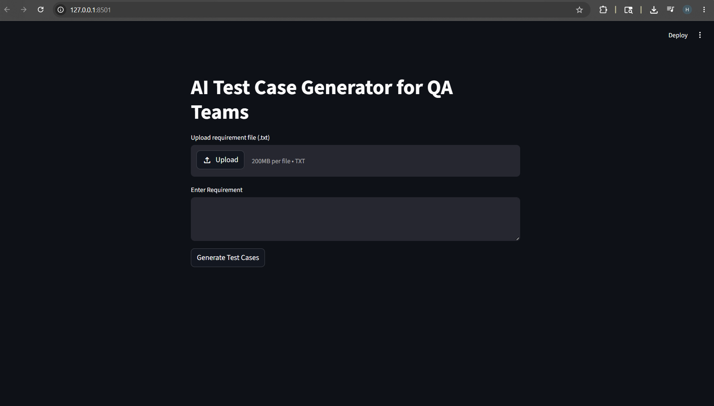

# AI Test Case Generator for QA Teams

## Overview

AI Test Case Generator for QA Teams is an AI-powered application that automatically generates structured software test cases from user requirements using Gemini API and Streamlit.

The application helps reduce manual effort for QA engineers by generating:

- Functional test cases
- Negative test cases
- Edge test cases
- Priority levels for each test case

Users can upload requirement files or manually enter requirements and download generated test cases in CSV or Excel format.

---

## Features

 Upload requirement files (.txt)

 Manual requirement input

 AI-powered test case generation using Gemini API

 Automatic categorization:
- Functional
- Negative
- Edge

 Priority assignment:
- High
- Medium
- Low

 Summary dashboard

 Category filtering

 Download generated reports:
- CSV
- Excel

 Interactive Streamlit interface

---

## Screenshots

### Home Page



### Generated Output - Part 1

.png)

### Generated Output - Part 2

.png)

---

## Tech Stack

- Python
- Streamlit
- Gemini API
- Pandas
- OpenPyXL

---

## Project Structure

```text
AI-TestCase-Generator/
│
├── app.py
├── requirements.txt
├── README.md
├── screenshots/
│   ├── home.png
│   ├── output(1).png
│   └── output(2).png
```

---

## Installation

Clone the repository:

```bash
git clone https://github.com/HasiniPulavarthi/AI-TestCase-Generator.git
```

Move into project directory:

```bash
cd AI-TestCase-Generator
```

Install dependencies:

```bash
pip install -r requirements.txt
```

Run application:

```bash
streamlit run app.py --server.address 127.0.0.1
```

---

## Example Input

```text
User Login Feature:

- Email required
- Password minimum 8 characters
- Forgot password available
- User should receive an error for invalid credentials
```

---

## Example Output

| Test_ID | Category | Priority | Test_Case |
|----------|-----------|------------|------------|
| TC001 | Functional | High | Login with valid credentials |
| TC002 | Negative | High | Empty email field |
| TC003 | Edge | Medium | Password exactly 8 characters |

---

## Future Improvements

- Support PDF requirement files
- Generate automation scripts
- Add charts and analytics dashboard
- Deploy online
- Add chat-based interaction with requirements

---

## Author

**Hasini Pulavarthi**  

---

## Repository

GitHub Repository:

https://github.com/HasiniPulavarthi/AI-TestCase-Generator
